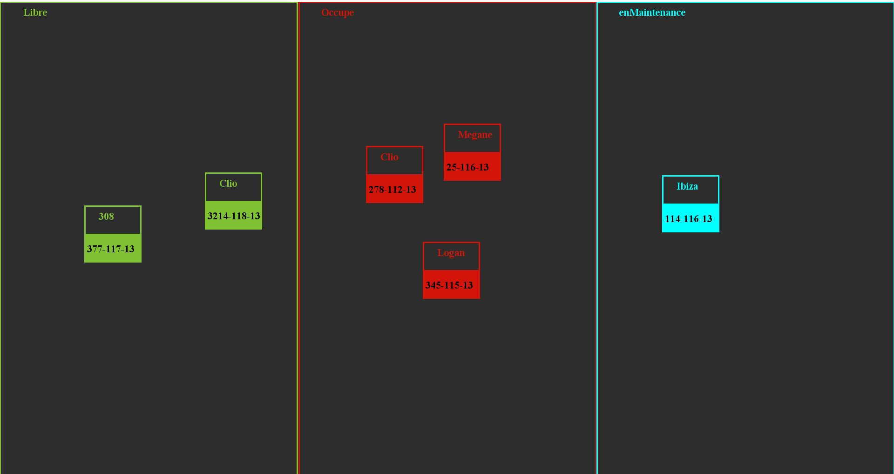

# GestionParcTaxi
une implémentation JAVA d'un gestionnaire de parc automobile d'une société de Taxi dans le cadre d'une formation java.

Soit les classes decrivant la [fenetre](GestionFlotte/src/winFlotte/Fenetre.java)  et le [panel](GestionFlotte/src/winFlotte/Pan.java).

Créez les classes necessaires à l'execution de ces classes.

